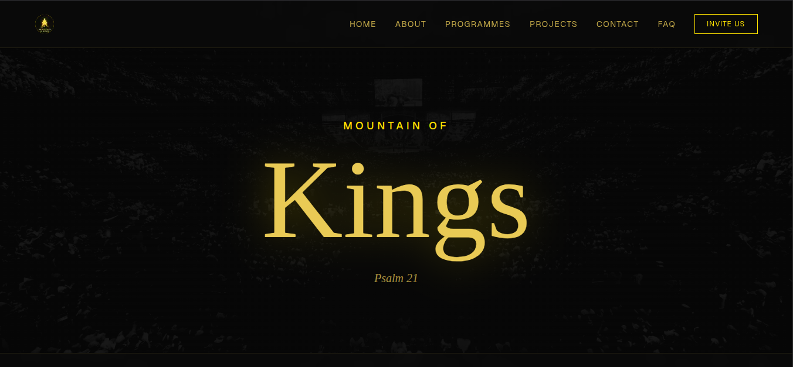

This **README** is designed to reflect the professional, technical, and spiritual DNA of the **Mountain of Kings Ministries (MOKM)** project. It provides a clear roadmap for any "Marketplace Apostle" or developer looking to contribute to the repository.

---

# 🏔️ Mountain of Kings Ministries (MOKM) Web Platform

### *Teaching, Raising, and Innovating for the Kingdom.*

The official digital gateway for **Mountain of Kings Ministries**. This platform serves as a global dispatch center for spiritual enlightenment and a repository for divine innovation, engineering schematics, and software solutions.

---

## 🛠️ Tech Stack

Built with a high-performance, modern stack to ensure stability and global reach:

* **Framework:** [Next.js 15+](https://nextjs.org/) (App Router)
* **Styling:** [Tailwind CSS v4](https://tailwindcss.com/blog/tailwindcss-v4-alpha) (CSS-first configuration)
* **Icons:** [Lucide React](https://lucide.dev/)
* **Typography:** Custom "KingDisplay" + [Geist Sans](https://vercel.com/font)
* **Animations:** Framer Motion & Native CSS Keyframes

---

## 🎨 Design System (Tailwind 4)

The project uses a high-contrast, "Royal Tech" color palette defined in `globals.css`:

| Variable | Hex | Usage |
| --- | --- | --- |
| `--background` | `#0a0a0a` | Deep Matte Black |
| `--text` | `#e6c25d` | Muted Gold (Typography) |
| `--accent` | `#ffd700` | Vibrant Gold (Glows & Highlights) |

---

## 📂 Project Structure

```bash
├── app/
│   ├── about/            # Mission, Pillars, and Leadership
│   ├── contact/          # Dynamic Switchboard (Invitation/Innovation/Support)
│   ├── faq/              # Knowledge Base Accordion
│   ├── programmes/       
│   │   └── [slug]/       # Multimedia Program Recaps (Video/Text/Image)
│   └── projects/         
│       └── [slug]/       # Technical Repository (Schematics/Code Blocks)
├── components/
│   ├── blocks/           # Modular Block Renderer (Code, Schematic, Formula)
│   ├── Hero.jsx          # B&W Crusade Background + Motion Text
│   ├── Navbar.jsx        # Responsive Glassmorphism Nav
│   └── Footer.jsx        # 3-Grid Global Footer
└── public/
    ├── fonts/            # Custom 'KingDisplay' Files
    └── images/           # High-Res Ministry Media

```

---

## ⚙️ Key Features

### 1. Modular Content Renderer

The platform uses a `BlockRenderer` system allowing the ministry to publish complex engineering projects or spiritual recaps by simply defining a JSON array of blocks:

* **SchematicBlock:** Renders SVG/Image blueprints with a technical spec sidebar.
* **CodeBlock:** A themed IDE-style component for software solutions.
* **FormulaBlock:** LaTeX support for scientific and mathematical "Idea Provisions."
* **VideoBlock:** Cinematic YouTube embeds for program highlights.

### 2. Contact Dispatch System

A query-param-driven contact page that allows users to specifically route their requests for:

* `?reason=invitation` (Global Ministrations)
* `?reason=innovation` (Technical Collaborations)
* `?reason=report` (Community Support & Supply needs)

### 3. Dynamic Filtering

The **Repository** and **Programmes** pages feature real-time search, category filtering, and date-based sorting (Newest Build vs. Oldest Build).

---

## 🚀 Getting Started

1. **Clone the repository:**
```bash
git clone https://github.com/your-username/mokm-web.git

```


2. **Install dependencies:**
```bash
npm install

```


3. **Run the development server:**
```bash
npm run dev

```


4. **Build for production:**
```bash
npm run build

```


---

## 📜 Scripture Pillar

> *"The king shall joy in thy strength, O LORD; and in thy salvation how greatly shall he rejoice!"* — **Psalm 21:1**

---

## 🤝 Collaboration

We believe the body of Christ should lead in innovation. If you are an engineer, scientist, or developer, we welcome your "Solution Provisions." Contact us via the **Innovation** channel on the website.

---

**© 2026 Mountain of Kings Ministries. Etched in Grace • Built for Impact.**
